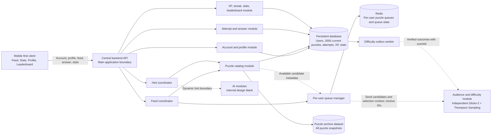
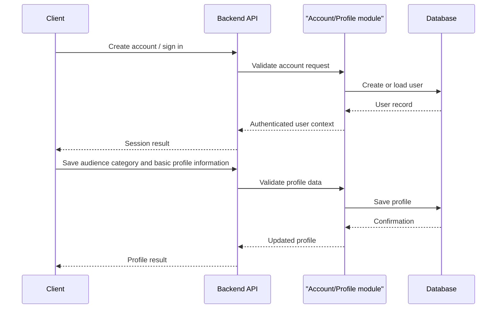
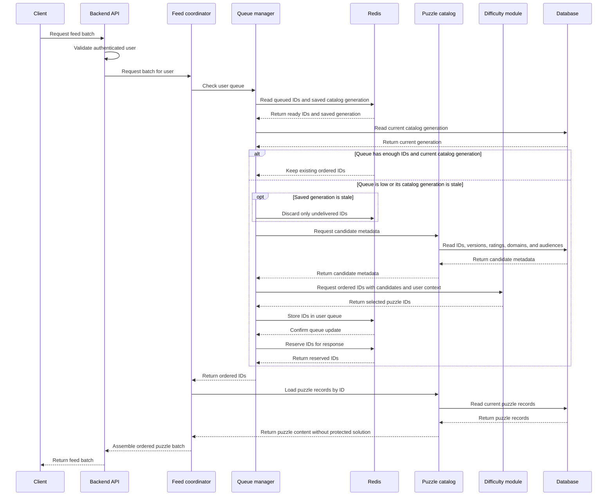
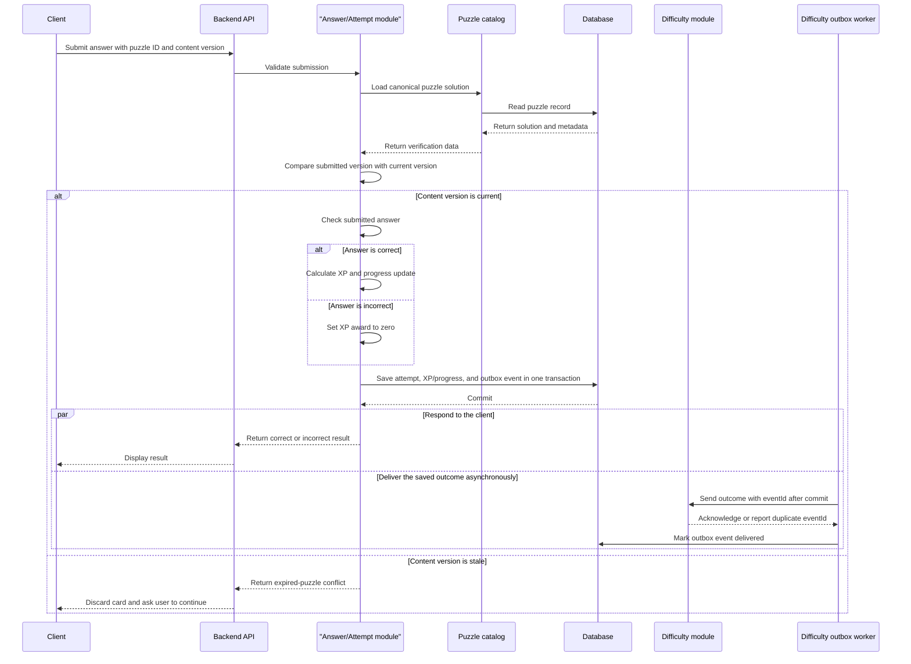
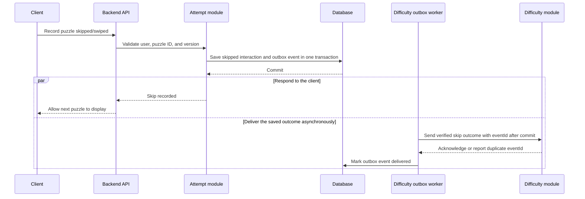
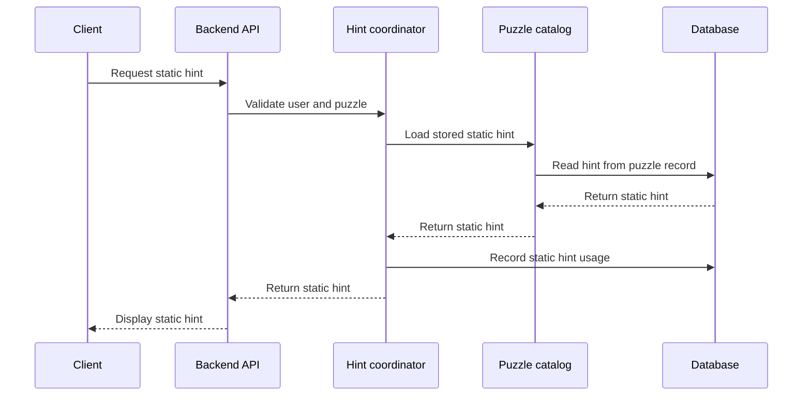
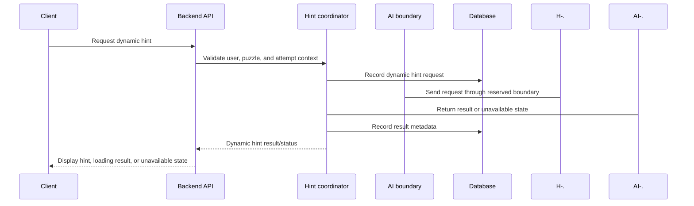
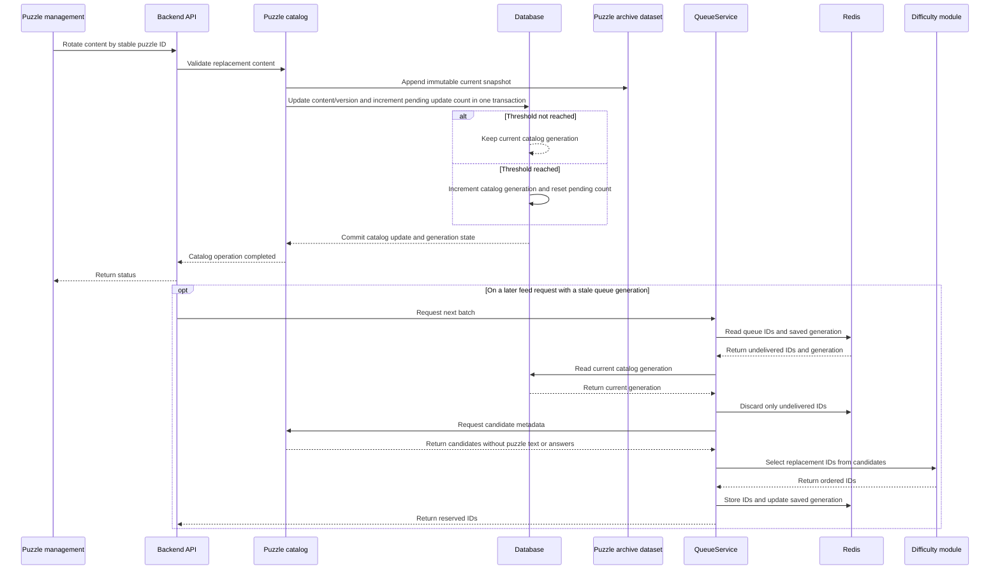

# PikPok — Detailed Project Architecture

## 1. Document purpose

This document defines the current logical architecture of PikPok based on the product idea, the reference UI, and the decisions discussed so far.

For a grouped list of unresolved choices, see [Open decisions](open-decisions.md).

It explains:

- How the client, backend, databases, Redis, and independent modules connect.
- How a user receives, solves, skips, and submits a puzzle.
- How personalized puzzle queues work.
- How puzzle batches are requested and preserved.
- How puzzle answers, attempts, hints, XP, streaks, statistics, and the leaderboard are recorded.
- Which information must be exchanged with modules owned by other team members.
- Which decisions are still open.

This is a logical architecture. It intentionally does not choose implementation frameworks or providers.

## 2. Scope boundaries

### 2.1 Included in this architecture

- Mobile-first client experience.
- User account and simple profile.
- One audience category: CHILDREN, TEENS, or NEURODIVERGENT.
- Main puzzle feed.
- Batch puzzle delivery.
- Per-user puzzle queue.
- Puzzle database/catalog.
- User and interaction data.
- Answer submission and correctness result.
- Static hints stored with puzzles.
- Dynamic-hint integration boundary.
- Independent difficulty module integration boundary.
- Independent Glicko-2 and Thompson Sampling difficulty-selection integration boundary.
- XP, daily puzzle, streak, statistics, and global leaderboard.
- Redis queue behavior.
- Fixed-size puzzle-content rotation and queue synchronization.
- API operations and logical data contracts.
- Multi-device access by the same user.

### 2.2 Explicitly left blank or undecided

The following areas are deliberately not designed in this document:

- AI model architecture.
- AI model selection.
- AI prompt design.
- AI training or evaluation.
- Dynamic-hint generation logic.
- AI deployment framework.
- Exact Glicko-2 calibration values, Thompson priors, and safety thresholds.
- Exact puzzle types and puzzle interaction formats.
- Exact answer-validation rules for every future puzzle type.
- Client framework.
- Backend framework.
- Database product/provider.
- Hosting provider.
- CI/CD tools.
- Observability tools.

These areas are represented only through contracts and placeholders where the rest of the application needs to connect to them.

## 3. Product behavior currently agreed

The primary user loop is:

```text
Open the app
    ↓
Receive a batch of puzzles
    ↓
View and solve the current puzzle
    ↓
Submit an answer or swipe past it
    ↓
Receive a correct/incorrect result when an answer is submitted
    ↓
Move to the next puzzle
    ↓
Request another batch when the local queue is low
```

The user may swipe without answering. A skipped puzzle is recorded as a user interaction but is not treated as a correct answer.

The first interface is expected to contain:

- Feed.
- Stats.
- Profile.
- Global leaderboard.

There is no Library section in the current scope. The share button and fast-forward button shown in the reference UI are removed from the current scope.

The user must have an account. The profile stores one of three audience categories: CHILDREN, TEENS, or NEURODIVERGENT. The age-specific eligibility rule for the NEURODIVERGENT category remains TBD; do not infer an age from the category. The exact authentication method is undecided.

The application is intended for a small prototype. The architecture should therefore stay simple while keeping clean boundaries so the project can evolve later.

## 4. High-level architecture



### 4.1 Architectural shape

The recommended shape is:

- One central backend for the main application.
- Internal backend modules for feed delivery, accounts, attempts, hints, and gamification.
- A separate logical audience/difficulty module because it owns audience eligibility, Glicko-2 skill state, and difficulty-based puzzle selection.
- Separate AI module boundaries, with their implementation intentionally omitted.
- One persistent database for the prototype, capable of storing flexible puzzle content.
- A separate append-only puzzle archive dataset for current and previous puzzle snapshots.
- Redis as the fast per-user queue and queue-state store.

The logical design is independent of implementation details. The selected technologies are recorded in [technical-stack-and-implementation.md](technical-stack-and-implementation.md).

## 5. Main components and responsibilities

### 5.1 Mobile-first client

The client is the user-facing application, built with Expo, React Native, and React Native Web for web and Android.

Responsibilities:

- Create or use the user’s authenticated session.
- Display the feed and current puzzle.
- Request an initial puzzle batch.
- Keep the received batch locally while the user moves through it.
- Request another batch before the local batch is exhausted.
- Display the question and supported answer controls.
- Allow the user to submit an answer.
- Allow the user to swipe past a puzzle.
- Display whether a submitted answer is correct or incorrect.
- Display static hints when the user requests them.
- Display a dynamic-hint loading/error/result state when that feature is connected.
- Send answer, skip, timing, and hint interactions to the backend.
- Display XP, streak, stats, and leaderboard data.
- Display basic profile information.

The client must not directly access the persistent database, Redis, or difficulty module.

### 5.2 Central backend API

The central backend is the main application boundary between the client and the rest of the system.

Responsibilities:

- Authenticate the user or validate the current session.
- Validate incoming requests.
- Coordinate the feed and queue.
- Load puzzle content from the catalog.
- Submit user answers for verification.
- Record attempts and skips.
- Record hint usage.
- Update XP and streak state.
- Return statistics and leaderboard data.
- Hide storage and module-specific details from the client.
- Apply idempotency to operations that may be retried.
- Keep the core feed working even if an optional AI capability is unavailable.

The backend should not expose the canonical solution before the user submits an answer. This makes backend-side answer verification possible and avoids trusting a client-side result.

### 5.3 Account and profile module

Responsibilities:

- Create a user account.
- Authenticate the user using the authentication method selected later.
- Maintain a stable user identifier.
- Store basic profile information.
- Store one audience category: children, teens, or NEURODIVERGENT users.
- Provide the backend with the identity required to locate the user’s queue and history.

The profile remains intentionally small for the prototype. Possible fields include:

- `userId`
- `displayName` or username
- Authentication identity
- `audienceCategory`
- Account creation timestamp
- Profile update timestamp

The exact fields and authentication method remain undecided.

### 5.4 Feed coordinator

The feed coordinator assembles the batch returned to the client.

Responsibilities:

- Receive a feed request from the backend API.
- Determine whether the user already has enough queued puzzle IDs.
- Ask the queue manager for the next reserved IDs.
- Load the complete puzzle records from the catalog.
- Filter out unavailable or missing records.
- Load the latest content version for each stable ID.
- Avoid returning duplicate recent puzzles when enough alternatives exist.
- Return an ordered batch to the client.

The feed coordinator does not implement the difficulty algorithm. It only uses the difficulty module’s output.

### 5.5 Per-user queue manager

The queue manager owns the delivery queue for each user.

Recommended ownership:

- The central backend owns queue lifecycle and delivery.
- The audience/difficulty module chooses which IDs should be added.
- Redis stores the fast queue state.

This separates selection from delivery. The difficulty module can change its algorithm without forcing the client to understand queue internals.

Responsibilities:

- Maintain an ordered queue per user.
- Preserve the user’s queue when the app is closed and reopened.
- Coordinate access when the same user uses multiple devices.
- Reduce repeated puzzles by tracking recently delivered IDs.
- Request available candidate metadata from the catalog when the queue is low or stale.
- Call the difficulty adapter with those candidates when the queue needs refilling.
- Refresh the queue after the catalog generation changes by replacing only undelivered IDs.
- Prevent the same queued item from being delivered twice during concurrent requests.
- Detect missing puzzle IDs and stale puzzle content versions.
- Support queue generation/version information.
- Recover or release a reserved ID after an interrupted request.

The queue contains puzzle IDs and queue metadata, not the authoritative puzzle content.

### 5.6 Puzzle catalog module

The catalog is the logical owner of puzzle records.

Responsibilities:

- Maintain exactly 3,000 current puzzle records.
- Read puzzle records by ID.
- Read multiple puzzle records for a batch.
- Update content by stable puzzle ID.
- Keep the puzzle ID and difficulty unchanged during rotation.
- Replace the question, solution, and static hints when content rotates.
- Increment the content version whenever content changes.
- Provide static hints associated with the current content.
- Keep the canonical solution available to the backend for verification.
- Write an immutable snapshot to the puzzle archive whenever a puzzle is created or its content is rotated.
- Increment the durable catalog generation after every five successful content updates. The queue manager uses that generation to reselect only undelivered IDs on each user's next feed request.

The live database contains exactly 3,000 current puzzles. Historical snapshots are stored in the separate puzzle archive dataset. The archive is not used to serve feed cards or verify expired submissions.

### 5.7 Attempt and answer module

Responsibilities:

- Receive a submitted answer.
- Confirm that the user is allowed to submit for the puzzle.
- Load the canonical puzzle solution from the catalog.
- Validate the submitted answer.
- Produce a correctness result.
- Record the attempt.
- Record timing information.
- Record whether the puzzle was skipped.
- Record hint usage associated with the attempt.
- Emit the outcome needed by XP, streak, statistics, and difficulty tracking.

The user currently wants the result to be simple:

- `correct`
- `incorrect`

For an incorrect answer, the client shows the incorrect result. In v1, the correct solution is not revealed automatically.

### 5.8 Hint coordinator

The hint coordinator exposes one client-facing hint capability while supporting two internal types:

1. Static hint.
2. Dynamic hint.

Static hints:

- Stored with the puzzle in the database.
- Returned when the user requests them.
- Available without calling an AI module.
- Recorded as hint usage.

Dynamic hints:

- Connected through an intentionally blank AI boundary.
- Requested through the backend rather than directly from the client.
- Recorded as a hint request and outcome.
- Allowed to have a loading, timeout, unavailable, or failed state.
- Must not block the basic feed or answer-submission flow.

The internal dynamic-hint process is outside the scope of this document.

### 5.9 Difficulty module

The difficulty module is independent from the core backend and owns Glicko-2 and Thompson Sampling selection.

The audience eligibility layer is intentionally small:

- A user has one selected audience category: CHILDREN, TEENS, or NEURODIVERGENT.
- Each puzzle declares the audience categories that may receive it.
- The module filters by audience category before applying difficulty selection.
- The category is an eligibility and safety input; it does not replace the user's skill rating.
- The age-specific eligibility rule for NEURODIVERGENT users remains TBD.

The complete difficulty-selection design is:

- Maintain a Glicko-2 state for every user and domain.
- Store rating, rating deviation, and volatility for each user-domain pair.
- Use category- and domain-based cold-start values when a user has no history in a domain.
- Translate the user's current rating into a target difficulty range.
- Use Thompson Sampling to choose among suitable puzzles in that range.
- Maintain alpha/beta statistics for each puzzle content version, identified by stable puzzle ID and contentVersion.
- Apply configured difficulty ceilings and floors so selection remains within safe bounds.
- Enforce domain-diversity rules so a batch does not over-concentrate on one domain.
- Apply streak-protection rules for younger users, especially children and teens.
- Support calibration and exploration behavior before and during personalized selection.
- Update the user's Glicko-2 state and puzzle-version success/failure statistics from correct or incorrect results.
- Record skips for repeat avoidance, but treat them as unknown: a skip does not change the user's skill rating or the puzzle-version success/failure statistics in the first version.

Correct/incorrect answers update the skill and puzzle-version outcome statistics. Skips are still sent as events and recorded for repeat avoidance, but are neutral for those statistics in the first version. Timing and hint use may be recorded as context; they do not change the score until the difficulty owner defines and validates a weighting rule. The core backend sends the agreed facts and does not reproduce the Glicko-2 or Thompson Sampling mathematics.

The module returns an ordered list of stable puzzle IDs for a requested batch. It does not implement answer verification, queue delivery, XP, puzzle storage, or AI behavior. The backend loads the current content version and rejects stale submissions.

### 5.10 XP, streak, statistics, and leaderboard module

Responsibilities:

- Award XP for verified successful interactions.
- Track the daily puzzle.
- Track the user’s daily streak.
- Aggregate completed and attempted puzzles.
- Aggregate correct and incorrect answers.
- Expose simple statistics.
- Maintain the global leaderboard.

Recommended simple XP rule for the prototype:

- Correct answer: award XP.
- Incorrect answer: award zero XP.
- Skipped puzzle: award zero XP.
- Using a hint: does not remove XP, but is recorded.
- More advanced XP weighting by difficulty can be added later.

In v1, award 10 XP for a verified correct answer and 0 XP for an incorrect or skipped puzzle. Do not apply multipliers. The backend owns this rule; the client never supplies the XP amount.

Agreed initial streak rule:

- A user maintains a daily streak by completing the daily puzzle.
- The daily puzzle is recorded separately from ordinary feed activity.
- The streak is updated only from a verified backend event.
- Streak dates use one configured application time zone.

Agreed initial leaderboard rule:

- One global leaderboard.
- All-time, ranked by accumulated XP; break equal-XP ties by stable user ID.
- No friends leaderboard or additional audience-specific leaderboards.

### 5.11 Persistent database

The database is the source of truth for durable application state.

For the small prototype, the recommended direction is one database with flexible puzzle content rather than two different persistent databases. This avoids unnecessary synchronization between a puzzle database and a user-activity database.

The selected persistent database is PostgreSQL with Prisma. Puzzle content may use flexible JSONB fields.

The database should store:

- Users and profiles.
- Puzzle records.
- Content versions and rotation metadata.
- Attempts.
- Skips.
- Hint usage.
- XP events or user XP totals.
- Daily puzzle participation.
- Streak state.
- Statistics or data from which statistics can be calculated.
- Leaderboard data or the records used to calculate it.
- Queue synchronization metadata if required.

Puzzle content may be represented as flexible JSON/document data inside the selected database. The exact puzzle schema is intentionally not fixed yet.

### 5.12 Redis

Redis is required as a fast queue/state component.

Recommended responsibilities:

- Store each user’s ordered puzzle IDs.
- Store queue generation or rotation generation information.
- Store recent puzzle IDs used for duplicate reduction.
- Store temporary reservations for concurrent or multi-device requests.
- Support fast refill and consumption of batches.

Redis is not the source of truth for puzzle content, user attempts, XP, or leaderboard history.

If Redis data is lost while Redis is available, the backend reconstructs the user’s queue through QueueService: it requests candidate metadata from the catalog, asks the difficulty module for IDs, then loads current puzzle records from the database. If Redis itself is unavailable, the feed returns a retryable error until Redis is available again.

### 5.13 Puzzle archive dataset

The puzzle archive is separate from live serving and stores append-only JSON snapshots for every puzzle version, including the initial 3,000 records and every later content version. Key each snapshot by stable puzzle ID and content version. Store it in object storage, restrict access to the backend and maintainers, and back it up. The provider and retention period remain open.

It should store:

- Stable puzzle ID.
- Content version.
- Puzzle content.
- Canonical solution, protected by archive access controls.
- Static hints.
- Audience category metadata.
- Difficulty metadata.
- Created or archived timestamp.
- Rotation or source metadata when available.

The archive is used for historical records, dataset analysis, auditing, and future work. It is not part of the live feed, Redis queues, or stale-answer verification path.

## 6. Logical data model

The following entities use the same camelCase field names as the JSON contracts. Puzzle-specific content fields remain open.

### 6.1 User

```text
User
-----
userId
authenticationIdentity
displayName                 [optional / TBD]
audienceCategory            CHILDREN / TEENS / NEURODIVERGENT
createdAt
updatedAt
status
```

The authentication identity should not be exposed publicly on the leaderboard.

### 6.2 Puzzle

```text
Puzzle
------
puzzleId                    stable identifier
contentVersion             increments when content changes
content                      current flexible puzzle content
answerOptions               optional; format TBD
domain                      required selection domain
difficultyRating            required numeric selection rating; exact scale TBD
audienceCategories          CHILDREN / TEENS / NEURODIVERGENT
canonicalSolution           current server-side verification data
staticHints                 hints for current content
type                  TBD
difficultyMetadata          optional generation or calibration details
explanationMetadata         TBD
createdAt
updatedAt
nextRotationAt             optional scheduler metadata
```

The puzzle type, answer format, exact difficulty scale, and neurodivergent age rule remain open. Every selectable puzzle must have a domain, numeric difficulty rating, and at least one audience category. The difficulty rating must use the scale agreed with the difficulty module for its target-range comparisons. The stable ID and configured difficulty value are not changed by content rotation.

The canonical solution should remain protected from the client until answer processing requires it. Previous content is retained only in the separate archive dataset, never in the live puzzle record.

```text
PuzzleArchiveRecord
-------------------
archiveRecordId
puzzleId
contentVersion
content
canonicalSolution
staticHints
audienceCategories
difficultyRating
createdAt
archivedAt
rotationMetadata
```

Archive records are immutable snapshots. The archive is not queried to serve feed cards or verify a stale answer.

### 6.3 Puzzle attempt

```text
PuzzleAttempt
-------------
attemptId                   idempotent interaction identifier
userId
puzzleId
contentVersion              version displayed to the user
sessionId                   optional
submittedAnswer             format TBD
result                       correct / incorrect / skipped
startedAt                   optional
submittedAt
elapsedTimeMs              optional
staticHintCount
dynamicHintCount
xpAwarded
clientDeviceId             optional
createdAt
```

Every answer, skip, or equivalent completed interaction should be recorded with the content version that the client displayed. This lets the backend identify stale submissions and lets analytics distinguish interactions with different content versions. The old puzzle content is not retained in the live database; it is represented by the archive snapshot.

### 6.4 Hint request

```text
HintRequest
-----------
hintRequestId
userId
puzzleId
attemptId                   optional
hintType                    static / dynamic
requestedAt
status                       delivered / failed / unavailable / TBD
responseMetadata            optional
```

The dynamic hint content and its internal metadata remain part of the AI workstream.

### 6.5 Difficulty state

```text
UserDomainRating
----------------
userId
domain
rating
ratingDeviation
volatility
coldStartCategory
updatedAt

PuzzleVersionBandStats
----------------------
puzzleId
contentVersion
alpha
beta
interactionCount
updatedAt
```

The difficulty module owns these records or their equivalent. The puzzle statistics key is the pair of stable puzzle ID and content version, so rotating content creates new evidence without changing the queue ID.

The core backend also persists a `DifficultyOutboxEvent` for each accepted answer or skip in the same transaction as that interaction. Each event has a unique `eventId`, payload, delivery status, and timestamps. A worker retries pending events; the difficulty module ignores an `eventId` it has already processed.

### 6.6 XP event

```text
XPEvent
-------
xpEventId
userId
source                       correct answer / daily puzzle / future source
referenceId                 attempt or daily-puzzle identifier
amount
createdAt
```

Using XP events makes the total explainable and allows future corrections. A simpler prototype may also maintain a user XP total, but the source of each award should remain traceable.

### 6.7 Daily puzzle participation

```text
DailyPuzzleParticipation
-------------------------
userId
dailyPuzzleId
date
completed
completedAt
xpAwarded
```

This entity supports the daily streak without requiring the entire feed to be treated as a daily challenge.

### 6.8 User streak

```text
UserStreak
----------
userId
currentStreak
longestStreak
lastCompletedDate
updatedAt
```

The streak must be updated from server-recorded completion, not from a value supplied by the client.

### 6.9 User queue state

The ordered puzzle IDs are stored in Redis. The durable database may store only synchronization metadata if needed.

```text
UserQueueState
--------------
userId
queueGeneration
catalogGenerationSeen
lastRefilledAt
lastConsumedAt
reservedCount
status
```

Logical Redis structures may include:

```text
userQueue:{userId}
userRecentPuzzles:{userId}
userQueueGeneration:{userId}
userQueueReservations:{userId}
```

These are logical names, not a final implementation requirement.

### 6.10 Catalog synchronization state

The persistent database owns one `catalogGeneration` value and a pending successful-content-update count. After every five successful rotations, increment `catalogGeneration` and reset the pending count. Each user's Redis queue stores the generation it last used. On that user's next feed request, a generation mismatch means the backend discards and reselects only IDs still waiting in Redis. IDs already reserved for an in-flight response or already returned to the client are left alone.

## 7. Data ownership and source of truth

| Data | Authoritative owner | Fast copy or derived form | Notes |
|---|---|---|---|
| User account | Persistent database | Auth/session cache if needed | Stable user identity. |
| User audience category | Persistent database | Session context | Used by category-based selection. |
| Full puzzle content | Puzzle catalog/database | Optional response cache | Database remains canonical. |
| Canonical solution | Puzzle catalog/backend | Never expose before verification | Used for answer checking. |
| Static hints | Puzzle catalog/database | Optional client copy after request | Stored with the puzzle. |
| User puzzle order | Redis user queue | Optional database metadata | Rebuilt if Redis is lost. |
| Recently seen IDs | Redis or database history | Queue-support state | Used to reduce repetition. |
| Attempts and answers | Persistent database | Statistics aggregates | Must survive content rotations and per-user queue reselection. |
| Hint usage | Persistent database | Statistics aggregates | Static and dynamic separated. |
| XP | Persistent database | Leaderboard aggregate/cache | Awarded by backend. |
| Daily streak | Persistent database | Profile response | Updated from verified completion. |
| Leaderboard | Derived from persistent data | Optional fast ranking copy | Global scope for v1. |
| Audience/difficulty selection state | Audience/difficulty module ownership | Storage location TBD | Backend provides category and interaction context. |
| Glicko-2 and Thompson state | Difficulty module ownership | Storage location/format TBD | Includes user-domain rating, deviation, volatility, and puzzle-version alpha/beta statistics. |
| Historical puzzle snapshots | Puzzle archive dataset | None required for live serving | Used for archive, analysis, and future work. |
| Catalog generation and pending update count | Persistent database | Per-user generation watermark in Redis | Generation increments after every five successful content updates. |

## 8. User flows

### 8.1 Account creation and profile setup



The exact authentication method remains undecided. The architecture only requires a stable user identity before the user’s personalized queue can be used.

### 8.2 Opening the feed



The client receives a batch rather than making one request for every swipe. This reduces request frequency and allows the feed to feel continuous.

### 8.3 Answer submission



The client is not trusted to decide whether an answer is correct. The backend performs the verification using the canonical solution.

### 8.4 Skipping or swiping past a puzzle



A skipped puzzle does not award XP. The skip is recorded for repeat avoidance, but does not count as a correct or incorrect result for Glicko-2 or puzzle-version success/failure statistics in the first version.

### 8.5 Static hint request



### 8.6 Dynamic hint request



The AI participant is intentionally blank. This diagram only shows where the application connects to it.

### 8.7 Closing and reopening the app

The queue should be preserved when a user closes the app.

On reopening:

1. The client re-authenticates or restores its session.
2. The backend identifies the user.
3. The feed coordinator checks the user’s Redis queue.
4. Existing queued IDs are reused if valid.
5. A new batch is requested only if the queue is empty, too small, stale, or invalid.

This reduces unnecessary repeated selections and preserves the user’s place in the feed.

### 8.8 Multi-device access

The same account may be used on multiple devices.

The queue manager must therefore prevent unsafe concurrent consumption. The logical requirements are:

- A puzzle ID reserved by one request must not be returned again by another concurrent request unless repetition is deliberately allowed.
- Attempts must include a stable user ID and puzzle ID.
- Duplicate network retries must not create duplicate attempts.
- Queue operations should be atomic from the application’s perspective.
- If two devices request batches simultaneously, the backend must coordinate access to the shared user queue.

The exact Redis operation or locking technique is implementation-specific and intentionally omitted.

## 9. Batch and queue strategy

### 9.1 Recommended prototype values

The exact values are configuration, but a simple starting point is:

```text
Initial batch size:       5 puzzles
Refill threshold:         2 remaining puzzles
Recent duplicate window: configurable
    Successful content updates before catalog generation increments: 5
```

These values are not product decisions. They are safe initial defaults for reducing API calls without creating an unnecessarily large queue.

### 9.2 Batch creation

When the user requests a batch:

1. The backend identifies the user.
2. The queue manager checks the user's Redis queue and saved catalog generation.
3. If the catalog generation is newer, the queue manager removes only undelivered IDs and marks the queue for refill.
4. If the queue is low or marked for refill, the queue manager requests current candidate metadata from the catalog.
5. The queue manager sends those candidates, the user's audience category, and recent history to the difficulty module.
6. The queue manager stores the returned ordered IDs in Redis and records the current catalog generation.
7. The feed coordinator reserves IDs through the queue manager and loads full puzzle records from the catalog.
8. The backend returns the ordered batch to the client.

### 9.3 Reducing repeated puzzles

The user wants to reduce the probability of seeing the same puzzle repeatedly rather than requiring an absolute guarantee.

The system should therefore:

- Keep a recent-puzzle history per user.
- Send recently shown IDs to the difficulty module when requesting a batch.
- Reject duplicates within the same returned batch.
- Prefer unseen or less recently seen puzzles when alternatives exist.
- Allow a puzzle to return later if the catalog is small or the difficulty constraints are restrictive.

The exact percentage target is undecided.

### 9.4 Queue exhaustion

If the queue becomes empty:

1. The queue manager requests current candidate metadata from the catalog, then asks the difficulty module to filter and select IDs.
2. The new IDs are stored in Redis.
3. The corresponding puzzle records are loaded.
4. The client receives the next batch.

If the audience/difficulty module is temporarily unavailable, the backend uses a non-personalized fallback from the current 3,000-puzzle catalog while preserving the user’s audience category, recent-puzzle filters, and current-content checks.

### 9.5 Queue content

The queue should contain IDs rather than full puzzle documents because:

- Puzzle content remains authoritative in the database.
- Puzzle updates do not leave multiple full copies in Redis.
- Redis memory usage stays lower.
- Queue refresh replaces only undelivered IDs; puzzle content remains authoritative in the catalog.
- The feed coordinator can load the current content for the stable ID before returning it.

## 10. Puzzle catalog synchronization

The system contains exactly 3,000 live puzzle records. A rotation archives the current snapshot and changes the content of one existing live record while preserving its puzzle ID and configured difficulty.

Because every user has an individual queue, a single rotation leaves each queue alone. After five successful rotations, the catalog generation changes and each queue is refreshed lazily on that user's next batch request:

1. One puzzle is selected by ID on the fixed rotation schedule.
2. The current snapshot is written to the archive dataset.
3. Its content, solution, and static hints are replaced in the live record.
4. Its configured difficulty, audience categories, and puzzle ID remain unchanged.
5. After five successful content updates, increment the durable catalog generation and reset the pending update count.
6. On a user's next batch request, compare their Redis queue's saved catalog generation to the current one.
7. If it is behind, discard and reselect only undelivered IDs; keep already returned cards unchanged.
8. The latest content is loaded for every ID returned from the catalog.

The synchronization threshold is five successful content updates and should remain configurable. Queue refresh does not change the 3,000 catalog rows; it replaces only undelivered selections in an individual user's Redis queue.

### 10.1 Content rotation

Expected behavior:

- Select the existing puzzle by stable ID.
- If replacement content arrives with a new upstream/source identifier, map it to the selected existing catalog ID; do not insert a 3,001st record or change the application puzzle ID.
- Write the current live record to the archive dataset as an immutable snapshot keyed by puzzle ID and contentVersion.
- Replace its current content in one database transaction.
- If the live update fails after the archive write, keep the archive snapshot and retry the rotation idempotently; never delete an archive snapshot.
- Keep the same puzzle ID.
- Keep the same difficulty value.
- Keep the same audience category metadata.
- Replace the current solution and static hints.
- Increment the content version.
- Update the rotation timestamp.
- Increment the pending successful-content-update count.

At each scheduled rotation, the backend requests one replacement from the puzzle-generation engine. A backend scheduled job selects the record whose rotation time is earliest. The rotation interval remains to be chosen.

### 10.2 Content versioning

Expected behavior:

- Every content update increments the content version.
- The client sends the puzzle ID and content version when submitting an answer.
- The backend compares that version with the current database version.
- A stale submission is rejected as an expired puzzle.
- The client discards the expired card and continues.
- The archive is not consulted for verification.

### 10.3 Queue behavior after rotation

Expected behavior:

- A single content rotation does not immediately alter any user's queue.
- The catalog returns the latest content when the next batch is loaded.
- A user with old content already displayed may receive an expired-puzzle response.
- After five successful content updates, the catalog generation changes.
- On that user's next batch request, only undelivered IDs still in Redis are discarded and reselected.
- IDs already reserved for an in-flight response and cards already sent to the client are unchanged.

### 10.4 Queue refresh after catalog updates



The catalog update does not change the 3,000 live catalog rows. On each user's next feed request, the queue manager compares generations. If stale, it replaces only undelivered queued IDs; cards already sent to a client are unaffected and retain their content-version checks.

## 11. Requirements exchanged with other modules

### 11.1 Difficulty module input contract

Use `camelCase` for every REST/JSON field and every difficulty-adapter field. Internal names may differ only when an explicit mapping is defined.

The core backend should be able to send at least:

```text
DifficultySelectionRequest
---------------------------
userId
audienceCategory
batchSize
candidates: [{ puzzleId, contentVersion, difficultyRating, domain, audienceCategories }]
recentPuzzleIds
recentAttemptOutcomes
recentSkipOutcomes
currentUserContext          optional module context
catalogGeneration
audienceConstraints         optional
```

The queue manager asks the catalog for the current candidate metadata and sends that list to the difficulty module. The module owns eligibility filtering and ranking, including the Glicko and Thompson Sampling logic; the catalog remains the source of truth for which puzzles exist. The module receives metadata only, never puzzle text, canonical solutions, or hints. The request also carries the user's audience category and recent interaction context. The core system does not need to send private Glicko fields if the difficulty module owns and persists them.

### 11.2 Difficulty module output contract

The core backend needs at least:

```text
DifficultySelectionResponse
----------------------------
selectionId
userId
orderedPuzzleIds
selectionGeneration         optional
expiresAt                   optional
```

The selected IDs should:

- Be ordered for delivery.
- Be valid puzzle IDs.
- Be eligible for the user’s audience category and other supplied constraints.
- Avoid duplicates within one batch.
- Prefer not to repeat recently shown IDs.
- Be usable by the catalog module to load the full puzzle records.

The module may return additional metadata, such as target difficulty, domain, exploration/calibration status, or a selection reason, but the core backend should not require that metadata unless the team later decides it is needed.

### 11.3 Difficulty update input

After an interaction, the backend should provide a verified outcome such as:

```text
DifficultyOutcomeEvent
----------------------
eventId                    stable idempotency identifier
userId
puzzleId
contentVersion
domain
result                    correct / incorrect / skipped
outcomeScore              optional normalized score used by the difficulty module
elapsedTimeMs             optional
hintTierUsed              optional
attemptCount              optional
abandonedMs               optional
submittedAt
```

The event is emitted only after the interaction is accepted and persisted. Store it in a durable outbox in the same transaction as the attempt/skip, then retry with the same eventId until acknowledged. The difficulty module deduplicates by eventId. It updates user-domain Glicko-2 and puzzle-version success/failure statistics for correct or incorrect results; skips are neutral and may be used for repeat avoidance. Timing and hint signals are context only until a weighting rule is agreed. Selection requests can still be made once per batch to reduce API traffic.

### 11.4 Puzzle catalog input/output requirement

Any puzzle-creation or puzzle-generation workstream must provide a record that contains, at minimum:

- Stable puzzle ID.
- Puzzle content.
- Canonical solution.
- Static hints.
- Content version and rotation timestamp.
- Stable difficulty value.
- Audience categories, domain, and any metadata required by difficulty selection or rendering.

The exact content format, puzzle types, and metadata are intentionally blank.

### 11.5 AI module boundary

The core backend only needs an integration boundary for dynamic hints. The following is a placeholder contract, not an AI design:

```text
DynamicHintRequest
------------------
requestId
userId
puzzleId
contentVersion
attemptId                   optional
userQuestion                optional
currentAttemptContext       optional

DynamicHintResponse
-------------------
requestId
status                      success / unavailable / failed / TBD
hintContent                 TBD
nextGuidance                TBD
```

The internal AI modules, prompts, models, frameworks, and reasoning are intentionally not specified.

## 12. Logical API operations

The project does not require a particular API style. The following are logical operations that the client needs.

### 12.1 Account operations

```text
Create account
Authenticate account
Restore session
Get current profile
Update basic profile
```

### 12.2 Feed operations

```text
Request initial feed batch
Request next feed batch
Get current queue status          optional/internal
```

The feed response should include the ordered puzzle cards needed for rendering, but should exclude protected canonical solution data.

### 12.3 Puzzle interaction operations

```text
Submit answer
Record skipped puzzle
Request static hint
Request dynamic hint              placeholder
Record timing data                optional if client supports it
```

### 12.4 Gamification operations

```text
Get user XP
Get streak status
Get daily puzzle status
Get user statistics
Get global leaderboard
```

### 12.5 Internal operations

```text
Request difficulty batch
Send verified difficulty outcome
Rotate content for puzzle ID
Advance catalogGeneration after five successful rotations; reselect undelivered IDs lazily
Re-read current content on next batch
```

These internal operations do not need to be exposed directly to the client.

## 13. Example logical payloads

### 13.1 Feed batch response

```json
{
  "sessionId": "session-id",
  "queueGeneration": "generation-id",
  "puzzles": [
    {
      "puzzleId": "puzzle-id",
      "contentVersion": 1,
      "content": {},
      "staticHints": [],
      "type": null,
      "difficultyRating": 1200
    }
  ],
  "nextBatchRequiredAt": 2
}
```

The empty or null fields are intentional placeholders because puzzle formats and metadata have not yet been decided. `difficultyRating: 1200` is an example value only; the final scale must be agreed with the difficulty module.

### 13.2 Answer submission

```json
{
  "attemptId": "client-generated-id",
  "puzzleId": "puzzle-id",
  "contentVersion": 1,
  "submittedAnswer": {},
  "elapsedTimeMs": null,
  "staticHintsUsed": 0,
  "dynamicHintsUsed": 0
}
```

### 13.3 Answer result

```json
{
  "attemptId": "client-generated-id",
  "puzzleId": "puzzle-id",
  "result": "correct",
  "xpAwarded": 10,
  "streakUpdated": true
}
```

The only required correctness result is `correct` or `incorrect`. Additional progress fields can be included without changing the core interaction.

### 13.4 Difficulty selection response

```json
{
  "selectionId": "selection-id",
  "userId": "user-id",
  "orderedPuzzleIds": [
    "puzzle-id-1",
    "puzzle-id-2",
    "puzzle-id-3"
  ]
}
```

The difficulty module does not need to return complete puzzle content if the backend catalog already owns that data.

## 14. Stats and leaderboard

### 14.1 Initial Stats page

The Stats page can remain simple while still being useful. Recommended first metrics:

- Total puzzles attempted.
- Total puzzles solved correctly.
- Correct-answer percentage.
- Total XP.
- Current daily streak.
- Longest daily streak.
- Daily puzzle completion.
- Hints used.
- Average answer time, if timing is collected reliably.

Progress by puzzle type should be added once puzzle types are defined. The architecture should keep the puzzle type field extensible so this can be added later without redesigning the user model.

### 14.2 Global leaderboard

The first leaderboard is global and all-time, ranked by XP. Equal XP is ordered by stable user ID.

The leaderboard should return:

- Rank.
- Public display name (or a safe default when none is set).
- XP total.
- Optional current streak.

Only display name, XP, rank, and optional current streak are public. Authentication identity, audience category, and private attempts are not exposed.

The leaderboard must use backend-recorded XP, not values submitted by the client.

## 15. Reliability and failure behavior

### 15.1 Database is unavailable

- Do not acknowledge a submitted answer as saved unless persistence succeeded.
- Return a retryable error to the client.
- Avoid awarding XP before the attempt is safely recorded.

### 15.2 Redis is unavailable

- Return a retryable feed error while Redis is unavailable; the prototype does not provide a database-backed queue fallback.
- Reconstruct the user’s queue through the queue manager when Redis becomes available again.
- Do not lose attempts, XP, or profile data because they belong in the persistent database.

### 15.3 Difficulty module is unavailable

Configured fallback behavior:

- Select only current puzzles from the 3,000-record catalog that are eligible for the user's audience category.
- Exclude recently shown puzzle IDs when possible.
- Load and return the current content version for each selected stable puzzle ID.
- Return a non-personalized batch.
- Record that fallback selection was used.
- Resume personalized selection automatically when the difficulty module recovers.

The main feed should not completely fail just because personalization is temporarily unavailable.

### 15.4 AI module is unavailable

- Static hints should continue to work.
- The feed should continue to work.
- Answer submission should continue to work.
- The dynamic hint request should return an unavailable or retryable state.
- The exact fallback response remains part of the AI workstream.

### 15.5 Queue contains a missing puzzle ID or stale content

- If the ID is missing, remove or ignore it and request another ID.
- If the ID exists but the client submits an old content version, reject the submission as an expired puzzle.
- Ask the client to discard the stale card and continue.
- Do not retain the old content only for verification.
- Record the version mismatch for diagnosis.

### 15.6 Duplicate requests

Network retries can cause the same request to arrive more than once. The following operations should use an idempotency identifier:

- Answer submission.
- Skip recording.
- Hint request recording when appropriate.
- XP award creation.

Repeated delivery of the same request should not create duplicate attempts or duplicate XP.

## 16. Security and privacy baseline

The prototype should keep security simple but should still enforce the following:

- Every protected operation requires an authenticated user.
- User data is scoped to the authenticated user.
- The client cannot directly write XP, streaks, leaderboard values, or correctness results.
- The canonical solution is not sent before answer verification.
- Puzzle IDs and versions are validated on every attempt.
- Leaderboard output uses public display information only.
- Audience category should not be shown publicly unless explicitly required.
- Dynamic-hint requests should be associated with the authenticated user and puzzle.
- Request rate limits can be added later, especially for hint requests.

The exact authentication and authorization framework is undecided.

## 17. Performance and prototype priorities

The project is a small prototype, but the main user experience should still feel immediate.

Recommended priorities:

1. Load the first puzzle batch quickly.
2. Keep the next puzzles ready before the current local batch is exhausted.
3. Avoid one network request for every swipe.
4. Keep puzzle content reads efficient by loading a batch by IDs.
5. Keep Redis entries small by storing IDs instead of full puzzle documents.
6. Keep the feed independent from optional AI response latency.
7. Avoid rebuilding every user queue after every individual catalog change.
8. Preserve the user queue between app sessions.

The system should not be over-engineered with many independent services for the prototype. The central backend can contain the core modules while still communicating with the independent difficulty and AI boundaries.

## 18. Framework and technology decisions

The team selected the recommended starting stack. Exact dependency versions and service providers remain open.

```text
Client framework:              Expo + React Native + React Native Web
Mobile packaging approach:     Web and Android through Expo
Backend framework:             Node.js + Fastify + TypeScript
Persistent database product:   PostgreSQL + Prisma
Queue/cache:                   Redis; deployment product TBD
Authentication mechanism:      TBD
Hosting provider:              TBD
API style:                     REST/JSON with camelCase fields
AI frameworks/models:          Intentionally blank
Difficulty implementation:     Owned by difficulty workstream
```

For the prototype, one persistent database with flexible puzzle records is recommended over separate NoSQL and SQL databases unless the team already has a strong reason to split them.

## 19. Future puzzle-management component

An administrator or puzzle-management component is expected later but is not part of the current interface.

When added, it should support:

- Update content for an existing puzzle ID.
- Validate replacement content.
- Trigger or request the fixed-time rotation.
- View content version and rotation timestamp.
- View the stable difficulty value.
- Advance catalogGeneration after five successful updates; each user's next feed request replaces only undelivered queue IDs if stale.
- Inspect validation errors.

It should write through the catalog module rather than writing directly to Redis.

## 20. Current end-to-end architecture summary

```mermaid
sequenceDiagram
    participant U as User
    participant C as Client
    participant B as Feed/API
    participant Q as QueueService
    participant R as Redis queue
    participant G as Difficulty module
    participant P as Puzzle catalog
    participant D as Persistent database
    participant O as Difficulty outbox worker
    participant A as AI boundary

    U->>C: Open app
    C->>B: Authenticate and request feed batch
    B->>Q: Get next feed batch
    Q->>R: Read ready IDs and saved catalog generation

    alt Queue is low or catalog generation is stale
        Q->>P: Request candidate metadata
        P->>D: Read IDs, versions, difficulty, domains, and audiences
        D-->>P: Return candidate metadata
        P-->>Q: Return candidate metadata without puzzle text or answers
        Q->>G: Select from candidates using user category and history
        G-->>Q: Return ordered puzzle IDs
        Q->>R: Replace stale undelivered IDs and save current generation
    else Queue is ready
        R-->>Q: Return queued IDs
    end

    Q-->>B: Reserve next IDs
    B->>P: Load current puzzle records by ID
    P->>D: Read puzzle content
    D-->>P: Return puzzle data
    P-->>B: Return renderable puzzle data
    B-->>C: Return puzzle batch

    U->>C: Solve, request hint, or swipe

    opt Static hint
        C->>B: Request static hint
        B->>P: Read stored hint
        P-->>B: Return static hint
        B->>D: Record hint usage
        B-->>C: Display static hint
    end

    opt Dynamic hint
        C->>B: Request dynamic hint
        B-.->A: Reserved dynamic-hint request
        A-.->B: Reserved response
        B->>D: Record hint usage
        B-->>C: Return result/status
    end

    C->>B: Submit answer or skip with interaction ID and contentVersion
    B->>P: Load current puzzle version and protected solution
    P->>D: Read current record
    D-->>P: Return version and verification data
    P-->>B: Return current version and verification data

    alt Submitted version is stale
        B-->>C: Return expired-puzzle response; do not verify or award XP
    else Submitted version is current
        B->>D: Save interaction, XP if correct, and outbox event in one transaction
        D-->>B: Commit
        par Return interaction result
            B-->>C: Return correct, incorrect, or skipped result
        and Deliver saved outcome asynchronously
            O->>G: Send outcome with eventId after commit
            G-->>O: Acknowledge or report duplicate eventId
            O->>D: Mark outbox event delivered
        end
    end

    C->>B: Request next batch when queue is low
```

## 21. Remaining decisions

The agreed behavior is recorded in [open-decisions.md](open-decisions.md). Items still open are:

- Exact authentication method/provider, hosting provider, Node.js release, and Redis deployment.
- The age-specific eligibility rule for the NEURODIVERGENT audience.
- Puzzle difficulty rating scale and exact Glicko-2/Thompson Sampling parameter and prior values.
- Puzzle types, content shape, and answer-validation rules, deferred until puzzle-generation work is ready.
- The rotation interval; replacement content comes from the generation engine.
- Exact routes and payload schemas in the shared OpenAPI contract.
- Batch/refill thresholds, repeat-reduction window, and Redis reservation/recovery implementation, to be tuned or finalized during implementation.
- Archive storage provider and retention period.

D-11's dynamic-hint details remain intentionally blank; the unavailable placeholder boundary is sufficient for this version.
