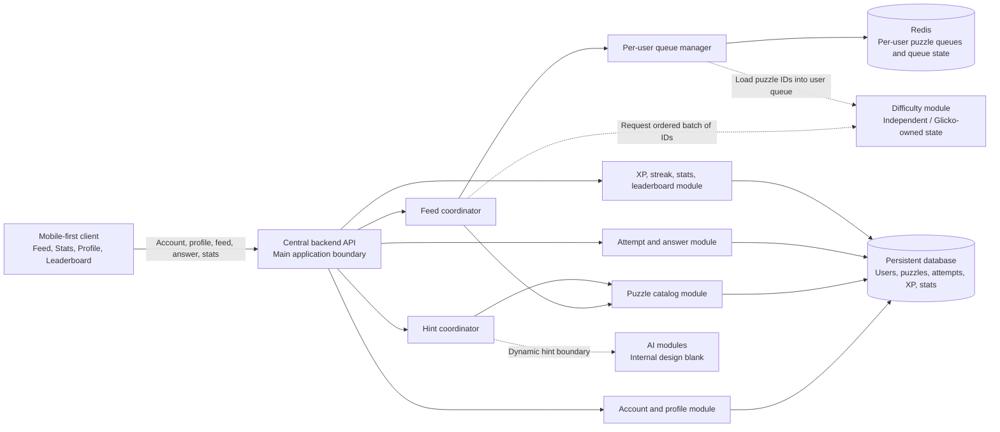
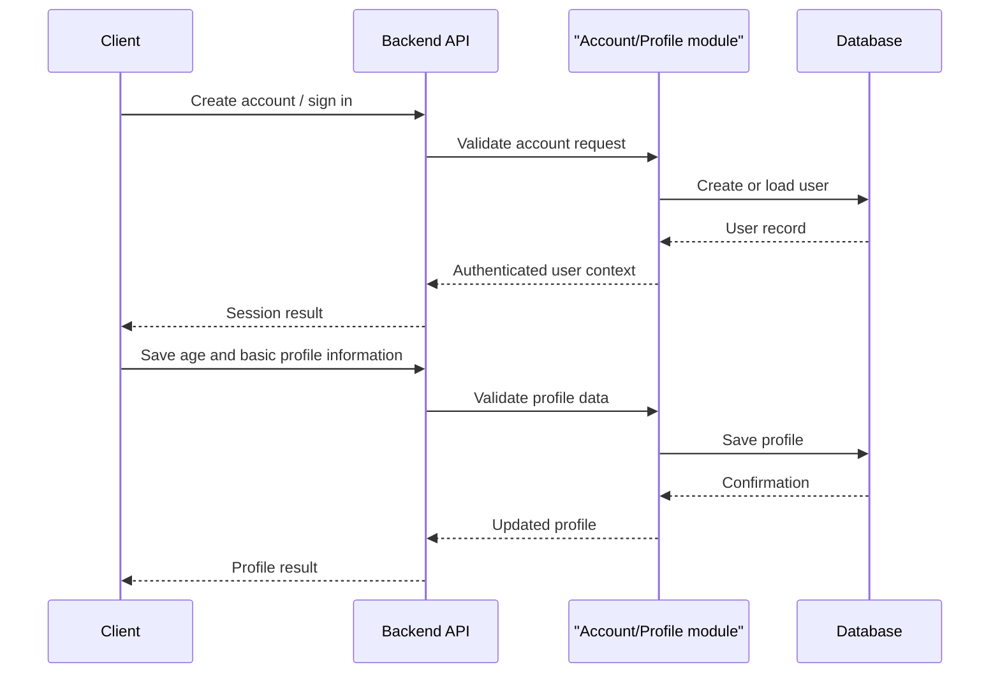
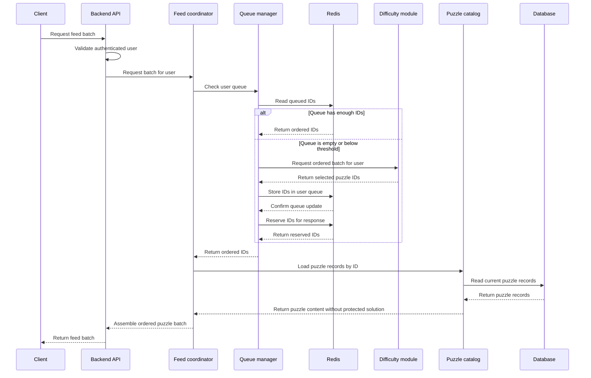
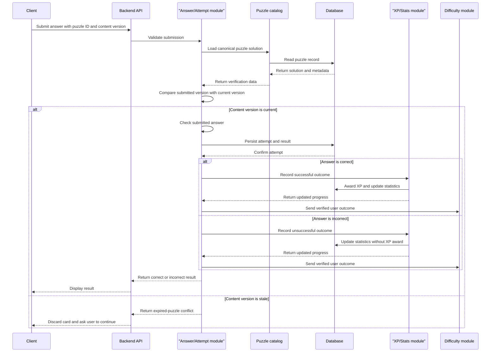
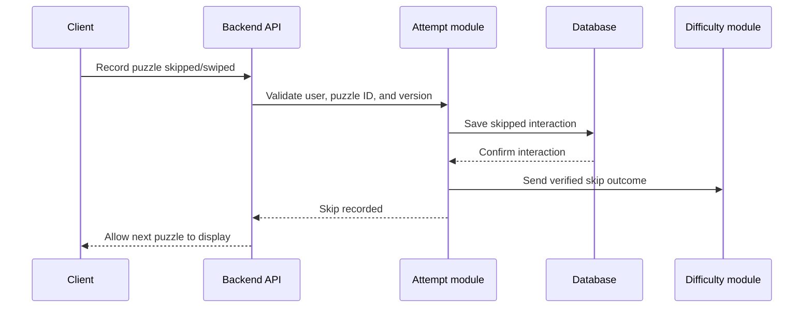
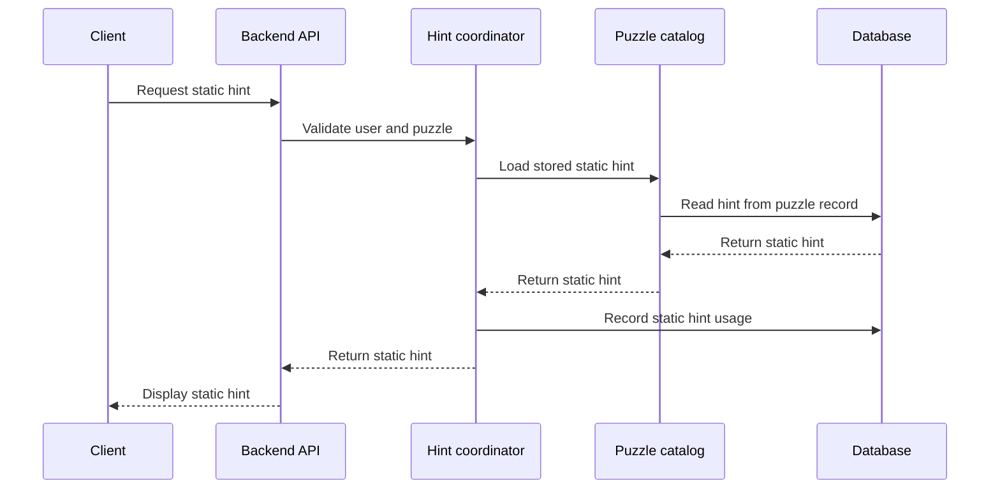
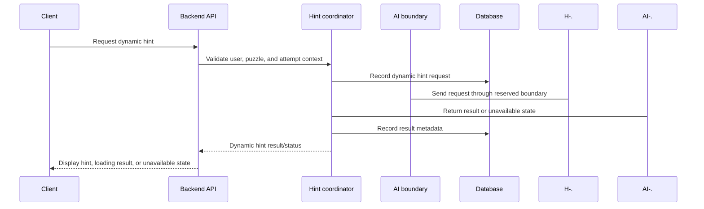
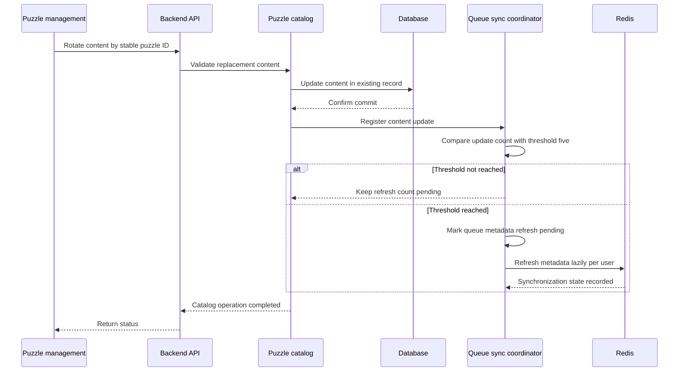
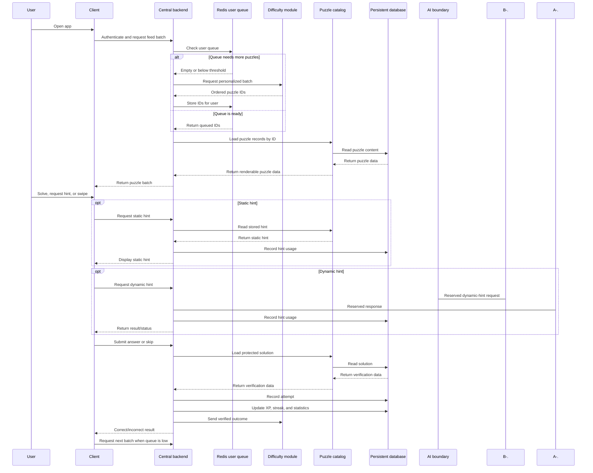

# PikPok — Detailed Project Architecture

## 1. Document purpose

This document defines the current logical architecture of PikPok based on the product idea, the reference UI, and the decisions discussed so far.

It explains:

- How the client, backend, databases, Redis, and independent modules connect.
- How a user receives, solves, skips, and submits a puzzle.
- How personalized puzzle queues work.
- How puzzle batches are requested and preserved.
- How puzzle answers, attempts, hints, XP, streaks, statistics, and the leaderboard are recorded.
- Which information must be exchanged with modules owned by other team members.
- Which decisions are still open.

This is a logical architecture. It intentionally does not choose implementation frameworks or providers.

## 2. Scope boundaries

### 2.1 Included in this architecture

- Mobile-first client experience.
- User account and simple profile.
- User age as profile information.
- Main puzzle feed.
- Batch puzzle delivery.
- Per-user puzzle queue.
- Puzzle database/catalog.
- User and interaction data.
- Answer submission and correctness result.
- Static hints stored with puzzles.
- Dynamic-hint integration boundary.
- Independent difficulty module integration boundary.
- Glicko-related user state integration requirement.
- XP, daily puzzle, streak, statistics, and global leaderboard.
- Redis queue behavior.
- Fixed-size puzzle-content rotation and queue synchronization.
- API operations and logical data contracts.
- Multi-device access by the same user.

### 2.2 Explicitly left blank or undecided

The following areas are deliberately not designed in this document:

- AI model architecture.
- AI model selection.
- AI prompt design.
- AI training or evaluation.
- Dynamic-hint generation logic.
- AI deployment framework.
- Difficulty algorithm implementation.
- Exact Glicko implementation and parameter tuning.
- Exact puzzle types and puzzle interaction formats.
- Exact answer-validation rules for every future puzzle type.
- Client framework.
- Backend framework.
- Database product/provider.
- Hosting provider.
- CI/CD tools.
- Observability tools.

These areas are represented only through contracts and placeholders where the rest of the application needs to connect to them.

## 3. Product behavior currently agreed

The primary user loop is:

```text
Open the app
    ↓
Receive a batch of puzzles
    ↓
View and solve the current puzzle
    ↓
Submit an answer or swipe past it
    ↓
Receive a correct/incorrect result when an answer is submitted
    ↓
Move to the next puzzle
    ↓
Request another batch when the local queue is low
```

The user may swipe without answering. A skipped puzzle is recorded as a user interaction but is not treated as a correct answer.

The first interface is expected to contain:

- Feed.
- Stats.
- Profile.
- Global leaderboard.

There is no Library section in the current scope. The share button and fast-forward button shown in the reference UI are removed from the current scope.

The user must have an account. The profile should remain simple and currently requires the user’s age. The exact authentication method is undecided.

The application is intended for a small prototype. The architecture should therefore stay simple while keeping clean boundaries so the project can evolve later.

## 4. High-level architecture



### 4.1 Architectural shape

The recommended shape is:

- One central backend for the main application.
- Internal backend modules for feed delivery, accounts, attempts, hints, and gamification.
- A separate logical difficulty module because it owns personalized selection and Glicko-related state.
- Separate AI module boundaries, with their implementation intentionally omitted.
- One persistent database for the prototype, capable of storing flexible puzzle content.
- Redis as the fast per-user queue and queue-state store.

This is not a commitment to a specific programming framework. The backend may later be implemented with the team’s chosen technology.

## 5. Main components and responsibilities

### 5.1 Mobile-first client

The client is the user-facing application. It may eventually be delivered as a mobile-first website, an installable mobile application, or both. The implementation choice is not fixed yet.

Responsibilities:

- Create or use the user’s authenticated session.
- Display the feed and current puzzle.
- Request an initial puzzle batch.
- Keep the received batch locally while the user moves through it.
- Request another batch before the local batch is exhausted.
- Display the question and supported answer controls.
- Allow the user to submit an answer.
- Allow the user to swipe past a puzzle.
- Display whether a submitted answer is correct or incorrect.
- Display static hints when the user requests them.
- Display a dynamic-hint loading/error/result state when that feature is connected.
- Send answer, skip, timing, and hint interactions to the backend.
- Display XP, streak, stats, and leaderboard data.
- Display basic profile information.

The client must not directly access the persistent database, Redis, or difficulty module.

### 5.2 Central backend API

The central backend is the main application boundary between the client and the rest of the system.

Responsibilities:

- Authenticate the user or validate the current session.
- Validate incoming requests.
- Coordinate the feed and queue.
- Load puzzle content from the catalog.
- Submit user answers for verification.
- Record attempts and skips.
- Record hint usage.
- Update XP and streak state.
- Return statistics and leaderboard data.
- Hide storage and module-specific details from the client.
- Apply idempotency to operations that may be retried.
- Keep the core feed working even if an optional AI capability is unavailable.

The backend should not expose the canonical solution before the user submits an answer. This makes backend-side answer verification possible and avoids trusting a client-side result.

### 5.3 Account and profile module

Responsibilities:

- Create a user account.
- Authenticate the user using the authentication method selected later.
- Maintain a stable user identifier.
- Store basic profile information.
- Store the user’s age.
- Provide the backend with the identity required to locate the user’s queue and history.

The profile remains intentionally small for the prototype. Possible fields include:

- `user_id`
- `display_name` or username
- Authentication identity
- `age`
- Account creation timestamp
- Profile update timestamp

The exact fields and authentication method remain undecided.

### 5.4 Feed coordinator

The feed coordinator assembles the batch returned to the client.

Responsibilities:

- Receive a feed request from the backend API.
- Determine whether the user already has enough queued puzzle IDs.
- Ask the difficulty module for a new ordered batch when necessary.
- Put selected IDs into the user’s queue.
- Reserve or remove IDs from the queue when constructing a response.
- Load the complete puzzle records from the catalog.
- Filter out unavailable or missing records.
- Load the latest content version for each stable ID.
- Avoid returning duplicate recent puzzles when enough alternatives exist.
- Return an ordered batch to the client.
- Ask for another batch when the user’s queue becomes empty or reaches its refill threshold.

The feed coordinator does not implement the difficulty algorithm. It only uses the difficulty module’s output.

### 5.5 Per-user queue manager

The queue manager owns the delivery queue for each user, subject to confirmation of the final ownership decision.

Recommended ownership:

- The central backend owns queue lifecycle and delivery.
- The difficulty module chooses which IDs should be added.
- Redis stores the fast queue state.

This separates selection from delivery. The difficulty module can change its algorithm without forcing the client to understand queue internals.

Responsibilities:

- Maintain an ordered queue per user.
- Preserve the user’s queue when the app is closed and reopened.
- Coordinate access when the same user uses multiple devices.
- Reduce repeated puzzles by tracking recently delivered IDs.
- Request another batch when the queue is low.
- Prevent the same queued item from being delivered twice during concurrent requests.
- Detect missing puzzle IDs and stale puzzle content versions.
- Support queue generation/version information.
- Recover or release a reserved ID after an interrupted request.

The queue contains puzzle IDs and queue metadata, not the authoritative puzzle content.

### 5.6 Puzzle catalog module

The catalog is the logical owner of puzzle records.

Responsibilities:

- Maintain exactly 3,000 current puzzle records.
- Read puzzle records by ID.
- Read multiple puzzle records for a batch.
- Update content by stable puzzle ID.
- Keep the puzzle ID and difficulty unchanged during rotation.
- Replace the question, solution, and static hints when content rotates.
- Increment the content version whenever content changes.
- Provide static hints associated with the current content.
- Keep the canonical solution available to the backend for verification.
- Trigger queue metadata synchronization after every configured number of content updates.

The database contains exactly 3,000 current puzzles. It does not keep retired, expired, or historical puzzle records.

### 5.7 Attempt and answer module

Responsibilities:

- Receive a submitted answer.
- Confirm that the user is allowed to submit for the puzzle.
- Load the canonical puzzle solution from the catalog.
- Validate the submitted answer.
- Produce a correctness result.
- Record the attempt.
- Record timing information.
- Record whether the puzzle was skipped.
- Record hint usage associated with the attempt.
- Emit the outcome needed by XP, streak, statistics, and difficulty tracking.

The user currently wants the result to be simple:

- `correct`
- `incorrect`

For an incorrect answer, the client should show the incorrect result. Whether the correct solution is later shown is not currently part of the required result and remains undecided.

### 5.8 Hint coordinator

The hint coordinator exposes one client-facing hint capability while supporting two internal types:

1. Static hint.
2. Dynamic hint.

Static hints:

- Stored with the puzzle in the database.
- Returned when the user requests them.
- Available without calling an AI module.
- Recorded as hint usage.

Dynamic hints:

- Connected through an intentionally blank AI boundary.
- Requested through the backend rather than directly from the client.
- Recorded as a hint request and outcome.
- Allowed to have a loading, timeout, unavailable, or failed state.
- Must not block the basic feed or answer-submission flow.

The internal dynamic-hint process is outside the scope of this document.

### 5.9 Difficulty module

The difficulty module is independent from the core backend and owns the logic for selecting puzzles according to user performance.

The team expects to use Glicko or a related rating approach, but the exact implementation belongs to that module.

The module should maintain or access per-user state that allows the rating to be updated continuously. The core backend must provide the module with the events and context it needs.

The difficulty module should not need to own complete puzzle delivery. It should return a selection result to the backend.

### 5.10 XP, streak, statistics, and leaderboard module

Responsibilities:

- Award XP for verified successful interactions.
- Track the daily puzzle.
- Track the user’s daily streak.
- Aggregate completed and attempted puzzles.
- Aggregate correct and incorrect answers.
- Expose simple statistics.
- Maintain the global leaderboard.

Recommended simple XP rule for the prototype:

- Correct answer: award XP.
- Incorrect answer: award zero XP.
- Skipped puzzle: award zero XP.
- Using a hint: does not remove XP, but is recorded.
- More advanced XP weighting by difficulty can be added later.

The exact XP amount is not fixed. It should be configurable rather than embedded in the client.

Recommended initial streak rule:

- A user maintains a daily streak by completing the daily puzzle.
- The daily puzzle is recorded separately from ordinary feed activity.
- The streak is updated only from a verified backend event.

Recommended initial leaderboard rule:

- One global leaderboard.
- Ranked by accumulated XP.
- No friends leaderboard or age-group leaderboard in the first version.

### 5.11 Persistent database

The database is the source of truth for durable application state.

For the small prototype, the recommended direction is one database with flexible puzzle content rather than two different persistent databases. This avoids unnecessary synchronization between a puzzle database and a user-activity database.

The exact database product is undecided.

The database should store:

- Users and profiles.
- Puzzle records.
- Content versions and rotation metadata.
- Attempts.
- Skips.
- Hint usage.
- XP events or user XP totals.
- Daily puzzle participation.
- Streak state.
- Statistics or data from which statistics can be calculated.
- Leaderboard data or the records used to calculate it.
- Queue synchronization metadata if required.

Puzzle content may be represented as flexible JSON/document data inside the selected database. The exact puzzle schema is intentionally not fixed yet.

### 5.12 Redis

Redis is required as a fast queue/state component.

Recommended responsibilities:

- Store each user’s ordered puzzle IDs.
- Store queue generation or rotation generation information.
- Store recent puzzle IDs used for duplicate reduction.
- Store temporary reservations for concurrent or multi-device requests.
- Support fast refill and consumption of batches.

Redis is not the source of truth for puzzle content, user attempts, XP, or leaderboard history.

If Redis is lost, the backend should be able to reconstruct the user’s queue by asking the difficulty module for another batch and loading puzzle records from the database.

## 6. Logical data model

The following entities describe the information needed by the architecture. Exact field names and puzzle-specific fields remain open.

### 6.1 User

```text
User
-----
user_id
authentication_identity
display_name                 [optional / TBD]
age
created_at
updated_at
status
```

The authentication identity should not be exposed publicly on the leaderboard.

### 6.2 Puzzle

```text
Puzzle
------
puzzle_id                    stable identifier
content_version             increments when content changes
content                      current flexible puzzle content
answer_options               optional; format TBD
puzzle_difficulty            stable difficulty value
canonical_solution           current server-side verification data
static_hints                 hints for current content
puzzle_type                  TBD
difficulty_metadata          TBD / owned partly by difficulty workstream
age_metadata                 TBD
explanation_metadata         TBD
created_at
updated_at
next_rotation_at             optional scheduler metadata
```

The puzzle type, answer format, age fields, and detailed difficulty metadata are intentionally left open because the team has not defined the puzzle formats yet. The stable ID and difficulty value are not changed by content rotation.

The canonical solution should remain protected from the client until answer processing requires it. Old content is not retained after a rotation.

### 6.3 Puzzle attempt

```text
PuzzleAttempt
-------------
attempt_id                   idempotent interaction identifier
user_id
puzzle_id
content_version              version displayed to the user
session_id                   optional
submitted_answer             format TBD
result                       correct / incorrect / skipped
started_at                   optional
submitted_at
elapsed_time_ms              optional
static_hint_count
dynamic_hint_count
xp_awarded
client_device_id             optional
created_at
```

Every answer, skip, or equivalent completed interaction should be recorded with the content version that the client displayed. This lets the backend identify stale submissions and lets analytics distinguish interactions with different content versions. The old puzzle content itself is not retained.

### 6.4 Hint request

```text
HintRequest
-----------
hint_request_id
user_id
puzzle_id
attempt_id                   optional
hint_type                    static / dynamic
requested_at
status                       delivered / failed / unavailable / TBD
response_metadata            optional
```

The dynamic hint content and its internal metadata remain part of the AI workstream.

### 6.5 XP event

```text
XPEvent
-------
xp_event_id
user_id
source                       correct answer / daily puzzle / future source
reference_id                 attempt or daily-puzzle identifier
amount
created_at
```

Using XP events makes the total explainable and allows future corrections. A simpler prototype may also maintain a user XP total, but the source of each award should remain traceable.

### 6.6 Daily puzzle participation

```text
DailyPuzzleParticipation
-------------------------
user_id
daily_puzzle_id
date
completed
completed_at
xp_awarded
```

This entity supports the daily streak without requiring the entire feed to be treated as a daily challenge.

### 6.7 User streak

```text
UserStreak
----------
user_id
current_streak
longest_streak
last_completed_date
updated_at
```

The streak must be updated from server-recorded completion, not from a value supplied by the client.

### 6.8 User queue state

The ordered puzzle IDs are stored in Redis. The durable database may store only synchronization metadata if needed.

```text
UserQueueState
--------------
user_id
queue_generation
rotation_generation_seen
last_refilled_at
last_consumed_at
reserved_count
status
```

Logical Redis structures may include:

```text
user_queue:{user_id}
user_recent_puzzles:{user_id}
user_queue_generation:{user_id}
user_queue_reservations:{user_id}
```

These are logical names, not a final implementation requirement.

## 7. Data ownership and source of truth

| Data | Authoritative owner | Fast copy or derived form | Notes |
|---|---|---|---|
| User account | Persistent database | Auth/session cache if needed | Stable user identity. |
| User age/profile | Persistent database | Session context | Used by selection if required. |
| Full puzzle content | Puzzle catalog/database | Optional response cache | Database remains canonical. |
| Canonical solution | Puzzle catalog/backend | Never expose before verification | Used for answer checking. |
| Static hints | Puzzle catalog/database | Optional client copy after request | Stored with the puzzle. |
| User puzzle order | Redis user queue | Optional database metadata | Rebuilt if Redis is lost. |
| Recently seen IDs | Redis or database history | Queue-support state | Used to reduce repetition. |
| Attempts and answers | Persistent database | Statistics aggregates | Must survive content rotations and queue metadata refreshes. |
| Hint usage | Persistent database | Statistics aggregates | Static and dynamic separated. |
| XP | Persistent database | Leaderboard aggregate/cache | Awarded by backend. |
| Daily streak | Persistent database | Profile response | Updated from verified completion. |
| Leaderboard | Derived from persistent data | Optional fast ranking copy | Global scope for v1. |
| Glicko state | Difficulty module ownership | Storage location TBD | Backend must provide required events. |

## 8. User flows

### 8.1 Account creation and profile setup



The exact authentication method remains undecided. The architecture only requires a stable user identity before the user’s personalized queue can be used.

### 8.2 Opening the feed



The client receives a batch rather than making one request for every swipe. This reduces request frequency and allows the feed to feel continuous.

### 8.3 Answer submission



The client is not trusted to decide whether an answer is correct. The backend performs the verification using the canonical solution.

### 8.4 Skipping or swiping past a puzzle



A skipped puzzle does not award XP. The difficulty module may use the skip as part of its own user modeling, but that behavior is outside this document.

### 8.5 Static hint request



### 8.6 Dynamic hint request



The AI participant is intentionally blank. This diagram only shows where the application connects to it.

### 8.7 Closing and reopening the app

The queue should be preserved when a user closes the app.

On reopening:

1. The client re-authenticates or restores its session.
2. The backend identifies the user.
3. The feed coordinator checks the user’s Redis queue.
4. Existing queued IDs are reused if valid.
5. A new batch is requested only if the queue is empty, too small, stale, or invalid.

This reduces unnecessary repeated selections and preserves the user’s place in the feed.

### 8.8 Multi-device access

The same account may be used on multiple devices.

The queue manager must therefore prevent unsafe concurrent consumption. The logical requirements are:

- A puzzle ID reserved by one request must not be returned again by another concurrent request unless repetition is deliberately allowed.
- Attempts must include a stable user ID and puzzle ID.
- Duplicate network retries must not create duplicate attempts.
- Queue operations should be atomic from the application’s perspective.
- If two devices request batches simultaneously, the backend must coordinate access to the shared user queue.

The exact Redis operation or locking technique is implementation-specific and intentionally omitted.

## 9. Batch and queue strategy

### 9.1 Recommended prototype values

The exact values are configuration, but a simple starting point is:

```text
Initial batch size:       5 puzzles
Refill threshold:         2 remaining puzzles
Recent duplicate window: configurable
Content updates before queue refresh: 5
```

These values are not product decisions. They are safe initial defaults for reducing API calls without creating an unnecessarily large queue.

### 9.2 Batch creation

When the user requests a batch:

1. The backend identifies the user.
2. The queue manager checks the user’s existing queue.
3. If the queue has enough IDs, it uses them.
4. If the queue is low, it requests another batch from the difficulty module.
5. The difficulty module uses the user’s current state and recent history.
6. The queue manager stores the returned IDs in the user’s queue.
7. The feed coordinator loads the full puzzle records.
8. The backend returns the ordered batch to the client.

### 9.3 Reducing repeated puzzles

The user wants to reduce the probability of seeing the same puzzle repeatedly rather than requiring an absolute guarantee.

The system should therefore:

- Keep a recent-puzzle history per user.
- Send recently shown IDs to the difficulty module when requesting a batch.
- Reject duplicates within the same returned batch.
- Prefer unseen or less recently seen puzzles when alternatives exist.
- Allow a puzzle to return later if the catalog is small or the difficulty constraints are restrictive.

The exact percentage target is undecided.

### 9.4 Queue exhaustion

If the queue becomes empty:

1. The backend requests another batch from the difficulty module.
2. The new IDs are stored in Redis.
3. The corresponding puzzle records are loaded.
4. The client receives the next batch.

If the difficulty module is temporarily unavailable, the fallback behavior is still undecided. The recommended prototype fallback is to select eligible records from the current 3,000-puzzle catalog while preserving age and recent-puzzle filters that are already available.

### 9.5 Queue content

The queue should contain IDs rather than full puzzle documents because:

- Puzzle content remains authoritative in the database.
- Puzzle updates do not leave multiple full copies in Redis.
- Redis memory usage stays lower.
- Queue metadata refreshes continue to deal with stable identifiers.
- The feed coordinator can load the current content for the stable ID before returning it.

## 10. Puzzle catalog synchronization

The system contains exactly 3,000 puzzle records. A rotation changes the content of one existing record while preserving its puzzle ID and difficulty.

Because every user has an individual queue, the queue IDs remain stable while puzzle content rotates. Queue metadata is refreshed lazily:

1. One puzzle is selected by ID on the fixed rotation schedule.
2. Its content, solution, and static hints are replaced in place.
3. Its difficulty and puzzle ID remain unchanged.
4. After five content updates, queue metadata is marked for refresh.
5. Each user’s queue is refreshed when they next request a batch.
6. The latest content is loaded for queued IDs.

The synchronization threshold is five content updates and should remain configurable.

### 10.1 Content rotation

Expected behavior:

- Select the existing puzzle by stable ID.
- If replacement content arrives with a new upstream/source identifier, map it to the selected existing catalog ID; do not insert a 3,001st record or change the application puzzle ID.
- Replace its current content in one database transaction.
- Keep the same puzzle ID.
- Keep the same difficulty value.
- Replace the current solution and static hints.
- Increment the content version.
- Update the rotation timestamp.
- Increment the pending queue-refresh count.

The first scheduler can select the record whose rotation time is earliest. The exact scheduler implementation remains a technology decision.

### 10.2 Content versioning

Expected behavior:

- Every content update increments the content version.
- The client sends the puzzle ID and content version when submitting an answer.
- The backend compares that version with the current database version.
- A stale submission is rejected as an expired puzzle.
- The client discards the expired card and continues.
- Old content is not retained for verification.

### 10.3 Queue behavior after rotation

Expected behavior:

- Queue entries keep the same stable IDs.
- A content rotation does not remove an ID from Redis.
- The catalog returns the latest content when the next batch is loaded.
- A user with old content already displayed may receive an expired-puzzle response.
- After five content updates, queue metadata is refreshed lazily on the next batch request.

### 10.4 Queue metadata refresh flow



The refresh does not replace the 3,000 IDs. It only ensures that future batches load the latest content versions. A user’s queue is refreshed when that user requests another batch.

## 11. Requirements exchanged with other modules

### 11.1 Difficulty module input contract

The core backend should be able to send at least:

```text
DifficultySelectionRequest
---------------------------
user_id
age
requested_batch_size
recent_puzzle_ids
recent_attempt_outcomes
recent_skip_outcomes
current_user_context        supplied or resolved by the difficulty module
rotation_generation         optional
eligible_puzzle_constraints optional
```

The exact difficulty statistics and Glicko fields are owned by the difficulty workstream. The core system should not invent or depend on the internal mathematical representation.

### 11.2 Difficulty module output contract

The core backend needs at least:

```text
DifficultySelectionResponse
----------------------------
selection_id
user_id
ordered_puzzle_ids
selection_generation        optional
expires_at                  optional
```

The selected IDs should:

- Be ordered for delivery.
- Be valid puzzle IDs.
- Be eligible for the user’s age and other supplied constraints.
- Avoid duplicates within one batch.
- Prefer not to repeat recently shown IDs.
- Be usable by the catalog module to load the full puzzle records.

The module may return additional metadata, such as selected difficulty or a reason, but the core backend should not require that metadata unless the team later decides it is needed.

### 11.3 Difficulty update input

After an interaction, the backend should provide a verified outcome such as:

```text
DifficultyOutcomeEvent
----------------------
user_id
puzzle_id
content_version
result                    correct / incorrect / skipped
elapsed_time_ms           optional
static_hint_used
dynamic_hint_used
submitted_at
```

The difficulty module can use this event to update the user’s Glicko state. The exact update frequency is expected to be after each verified interaction, but selection requests can still be made once per batch to reduce API traffic.

### 11.4 Puzzle catalog input/output requirement

Any puzzle-creation or puzzle-generation workstream must provide a record that contains, at minimum:

- Stable puzzle ID.
- Puzzle content.
- Canonical solution.
- Static hints.
- Content version and rotation timestamp.
- Stable difficulty value.
- Any metadata required by age filtering, difficulty selection, or rendering.

The exact content format, puzzle types, and metadata are intentionally blank.

### 11.5 AI module boundary

The core backend only needs an integration boundary for dynamic hints. The following is a placeholder contract, not an AI design:

```text
DynamicHintRequest
------------------
request_id
user_id
puzzle_id
content_version
attempt_id                  optional
user_question               optional
current_attempt_context     optional

DynamicHintResponse
-------------------
request_id
status                      success / unavailable / failed / TBD
hint_content                TBD
next_guidance               TBD
```

The internal AI modules, prompts, models, frameworks, and reasoning are intentionally not specified.

## 12. Logical API operations

The project does not require a particular API style. The following are logical operations that the client needs.

### 12.1 Account operations

```text
Create account
Authenticate account
Restore session
Get current profile
Update basic profile
```

### 12.2 Feed operations

```text
Request initial feed batch
Request next feed batch
Get current queue status          optional/internal
```

The feed response should include the ordered puzzle cards needed for rendering, but should exclude protected canonical solution data.

### 12.3 Puzzle interaction operations

```text
Submit answer
Record skipped puzzle
Request static hint
Request dynamic hint              placeholder
Record timing data                optional if client supports it
```

### 12.4 Gamification operations

```text
Get user XP
Get streak status
Get daily puzzle status
Get user statistics
Get global leaderboard
```

### 12.5 Internal operations

```text
Request difficulty batch
Send verified difficulty outcome
Rotate content for puzzle ID
Refresh queue metadata after five updates
Re-read current content on next batch
```

These internal operations do not need to be exposed directly to the client.

## 13. Example logical payloads

### 13.1 Feed batch response

```json
{
  "session_id": "session-id",
  "queue_generation": "generation-id",
  "puzzles": [
    {
      "puzzle_id": "puzzle-id",
      "content_version": 1,
      "content": {},
      "static_hints": [],
      "type": null,
      "difficulty": null
    }
  ],
  "next_batch_required_at": 2
}
```

The empty or null fields are intentional placeholders because puzzle formats and metadata have not yet been decided.

### 13.2 Answer submission

```json
{
  "attempt_id": "client-generated-id",
  "puzzle_id": "puzzle-id",
  "content_version": 1,
  "submitted_answer": {},
  "elapsed_time_ms": null,
  "static_hints_used": 0,
  "dynamic_hints_used": 0
}
```

### 13.3 Answer result

```json
{
  "attempt_id": "client-generated-id",
  "puzzle_id": "puzzle-id",
  "result": "correct",
  "xp_awarded": 10,
  "streak_updated": true
}
```

The only required correctness result is `correct` or `incorrect`. Additional progress fields can be included without changing the core interaction.

### 13.4 Difficulty selection response

```json
{
  "selection_id": "selection-id",
  "user_id": "user-id",
  "ordered_puzzle_ids": [
    "puzzle-id-1",
    "puzzle-id-2",
    "puzzle-id-3"
  ]
}
```

The difficulty module does not need to return complete puzzle content if the backend catalog already owns that data.

## 14. Stats and leaderboard

### 14.1 Initial Stats page

The Stats page can remain simple while still being useful. Recommended first metrics:

- Total puzzles attempted.
- Total puzzles solved correctly.
- Correct-answer percentage.
- Total XP.
- Current daily streak.
- Longest daily streak.
- Daily puzzle completion.
- Hints used.
- Average answer time, if timing is collected reliably.

Progress by puzzle type should be added once puzzle types are defined. The architecture should keep the puzzle type field extensible so this can be added later without redesigning the user model.

### 14.2 Global leaderboard

The first leaderboard should be global and ranked by XP.

The leaderboard should return:

- Rank.
- Public display name or safe identifier.
- XP total.
- Optional current streak.

Private authentication data and exact age should not be exposed publicly.

The leaderboard must use backend-recorded XP, not values submitted by the client.

## 15. Reliability and failure behavior

### 15.1 Database is unavailable

- Do not acknowledge a submitted answer as saved unless persistence succeeded.
- Return a retryable error to the client.
- Avoid awarding XP before the attempt is safely recorded.

### 15.2 Redis is unavailable

- The backend may request a fresh batch from the difficulty module.
- The backend may use a database-backed fallback queue for the prototype.
- Reconstruct the user’s queue when Redis becomes available again.
- Do not lose attempts, XP, or profile data because they belong in the persistent database.

### 15.3 Difficulty module is unavailable

The exact fallback is undecided. Recommended simple fallback:

- Use current puzzles from the 3,000-record catalog.
- Exclude recently shown puzzle IDs when possible.
- Return a non-personalized batch.
- Record that fallback selection was used.

The main feed should not completely fail just because personalization is temporarily unavailable.

### 15.4 AI module is unavailable

- Static hints should continue to work.
- The feed should continue to work.
- Answer submission should continue to work.
- The dynamic hint request should return an unavailable or retryable state.
- The exact fallback response remains part of the AI workstream.

### 15.5 Queue contains a missing puzzle ID or stale content

- If the ID is missing, remove or ignore it and request another ID.
- If the ID exists but the client submits an old content version, reject the submission as an expired puzzle.
- Ask the client to discard the stale card and continue.
- Do not retain the old content only for verification.
- Record the version mismatch for diagnosis.

### 15.6 Duplicate requests

Network retries can cause the same request to arrive more than once. The following operations should use an idempotency identifier:

- Answer submission.
- Skip recording.
- Hint request recording when appropriate.
- XP award creation.

Repeated delivery of the same request should not create duplicate attempts or duplicate XP.

## 16. Security and privacy baseline

The first version should keep security simple but should still enforce the following:

- Every protected operation requires an authenticated user.
- User data is scoped to the authenticated user.
- The client cannot directly write XP, streaks, leaderboard values, or correctness results.
- The canonical solution is not sent before answer verification.
- Puzzle IDs and versions are validated on every attempt.
- Leaderboard output uses public display information only.
- Exact age should not be shown publicly.
- Dynamic-hint requests should be associated with the authenticated user and puzzle.
- Request rate limits can be added later, especially for hint requests.

The exact authentication and authorization framework is undecided.

## 17. Performance and prototype priorities

The project is a small prototype, but the main user experience should still feel immediate.

Recommended priorities:

1. Load the first puzzle batch quickly.
2. Keep the next puzzles ready before the current local batch is exhausted.
3. Avoid one network request for every swipe.
4. Keep puzzle content reads efficient by loading a batch by IDs.
5. Keep Redis entries small by storing IDs instead of full puzzle documents.
6. Keep the feed independent from optional AI response latency.
7. Avoid rebuilding every user queue after every individual catalog change.
8. Preserve the user queue between app sessions.

The system should not be over-engineered with many independent services for the prototype. The central backend can contain the core modules while still communicating with the independent difficulty and AI boundaries.

## 18. Framework and technology decisions

These are intentionally not finalized.

```text
Client framework:              TBD
Mobile packaging approach:     TBD
Backend framework:             TBD
Persistent database product:   TBD
Redis deployment/product:      TBD
Authentication mechanism:      TBD
Hosting provider:              TBD
API style:                     No specific style required
AI frameworks/models:          Intentionally blank
Difficulty implementation:     Owned by difficulty workstream
```

Node.js has been mentioned as a possible backend direction. A mobile-first website and a cross-platform client capable of producing an APK have also been discussed. These are possibilities, not architecture decisions.

For the prototype, one persistent database with flexible puzzle records is recommended over separate NoSQL and SQL databases unless the team already has a strong reason to split them.

## 19. Future puzzle-management component

An administrator or puzzle-management component is expected later but is not part of the current first-version interface.

When added, it should support:

- Update content for an existing puzzle ID.
- Validate replacement content.
- Trigger or request the fixed-time rotation.
- View content version and rotation timestamp.
- View the stable difficulty value.
- Trigger queue metadata refresh after five updates.
- Inspect validation errors.

It should write through the catalog module rather than writing directly to Redis.

## 20. Current end-to-end architecture summary



## 21. Remaining decisions

The architecture can now be implemented at the logical level. The remaining decisions are mostly implementation details or requirements owned by other workstreams:

1. Exact client framework and whether the first release is web-only or web plus APK.
2. Exact backend framework.
3. Exact database product.
4. Exact authentication method.
5. Exact puzzle content schema.
6. Exact puzzle interaction types.
7. Exact answer-validation rules.
8. Exact batch size and refill threshold after testing.
9. Exact duplicate-reduction percentage.
10. Exact Redis queue ownership implementation.
11. Exact fixed rotation interval.
12. Exact queue metadata refresh behavior after five content updates.
13. Exact Glicko input fields and output metadata.
14. Difficulty-module fallback behavior.
15. Dynamic-hint contract details owned by the AI workstream.
16. Exact XP amount and any future XP multipliers.
17. Exact streak calendar/time-zone behavior.
18. Whether the global leaderboard is all-time, weekly, or both.
19. Exact public profile fields.

These unresolved items should remain configurable or marked TBD rather than being silently assumed.
